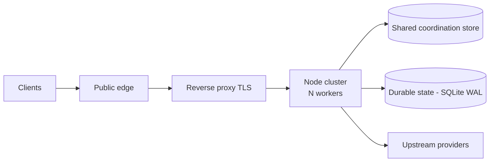

<div align="center">


# 9router-MW

**Enterprise AI routing gateway** — OpenAI-compatible `/v1/*` at high concurrency, with a multi-worker control plane, shared coordination store, and persistent keep-alive upstream pool.

Hardened production line of [decolua/9router](https://github.com/decolua/9router) for **sustained high-concurrency** workloads where the single-process upstream becomes the bottleneck.

[](https://github.com/fazulfi/9router-mw/releases/latest)
[](https://github.com/decolua/9router)
[](./LICENSE)

[Architecture](./docs/ARCHITECTURE-MW.md) · [Upstream](https://github.com/decolua/9router)

</div>

---

## What this is

| | |
| --- | --- |
| **Product** | `9router-mw` — multi-worker production line of 9Router |
| **Repo** | <https://github.com/fazulfi/9router-mw> |
| **Repo version** | `0.5.40-mw.2` (`VERSION` / `package.json`) |
| **Upstream base** | [decolua/9router](https://github.com/decolua/9router) `0.5.40` (ancestry merged) |
| **Resilience patterns** | Account semaphore + circuit breaker + settings cache (inspired by [Vanszs/VansRouter](https://github.com/Vanszs/VansRouter)) |

**Not** the npm package `9router` and **not** Docker Hub `decolua/9router`. This fork is private-ops / source deploy. For the general consumer product, install upstream.

---

## Why MW exists

Stock 9router is excellent as a single-process local gateway. Under high concurrent load, a single Node process becomes the bottleneck (event-loop contention, sync SQLite paths, no shared account claim across processes).

**9router-MW** keeps full upstream product capability (OpenAI-compatible API, multi-provider routing, RTK, combos, dashboard) and adds a production control plane:

1. **Multi-worker cluster** via `cluster.fork` (default production worker count; no single-worker default)
2. **Shared coordination store** (Redis) — cross-worker account semaphore, circuit breaker, usage buffer, global live dashboard
3. **SQLite better-sqlite3 + WAL** as the durable source of truth; the `sql.js` legacy path is not used in multi-worker deployments
4. **undici keep-alive** Agent as a process-local global dispatcher pool on the provider hot path
5. **No cluster fan-out** — the kernel/Node cluster delivers each accepted request to exactly one worker. Within that worker, upstream attempts may retry, fall back, or fan out to a panel for fusion; this is product behavior, not cluster multiplication

### Topology (production overview)

> Full mermaid system-context + worker hot path: **[`docs/ARCHITECTURE-MW.md`](./docs/ARCHITECTURE-MW.md)**
> Upstream single-process product map: [`docs/ARCHITECTURE.md`](./docs/ARCHITECTURE.md) — that diagram describes the stock product, not the MW production runtime.

```text
Clients (Claude Code, OpenCode, browser, OpenAI-compatible)
 → Public edge (reverse proxy TLS)
 → Loopback app bind (Next.js + open-sse)
   Node cluster: primary (fork + respawn only)
   ├─ worker 1 ─┐
   ├─ worker 2 ─┤ each: Next standalone + open-sse
   ├─ worker 3 ─┤ undici keep-alive → upstream providers
   └─ worker N ─┘ (OAuth / API key / compatible nodes)
   │
   ├─ Shared coordination store (Redis)
   │  semaphore · circuit breaker · usage buffer
   │  global dashboard live (pending / recent)
   └─ Durable state (SQLite WAL, better-sqlite3)
      source of truth for connections, nodes, settings, usage
MITM: OFF
```



### Request ownership vs upstream attempts

The cluster assigns each accepted request to **exactly one** worker. Workers do not rebroadcast or fan-out the same client request to peers, so a single client HTTP request never multiplies across the cluster.

That one worker, however, may issue **zero or more upstream attempts** as part of normal product behavior:

- local synthetic/bypass handling for eligible requests (zero upstream calls)
- token-refresh retry after a refreshable auth failure
- status/URL retry for transient network or redirect conditions
- account fallback within a provider (next account on cooldown or auth error)
- provider fallback when a whole provider is unavailable
- combo fallback across a sequence of models
- state-fusion fan-out: N panel calls plus a judge call

So the public guarantee is **no cluster fan-out**, not "exactly one upstream call". The worker is the unit of ownership, and product routing decides how many provider calls that ownership produces.

---

## Production snapshot

| Check | Result |
| ----- | ------ |
| `GET /api/health` | **200** — `ok`, worker id, coordination store ready, undici, better-sqlite3/WAL |
| `GET /` | redirect to `/dashboard` |
| `GET /v1/models` (no key) | **401** API key required |
| App bind | loopback only (not public) |
| Edge | public edge TLS in front of loopback bind |
| MITM | **OFF** in production |

### Production invariants

1. Multi-worker cluster is the default runtime; no single-worker default in production
2. Shared coordination store on a dedicated port; never reuse unrelated legacy ports
3. SQLite is **better-sqlite3 + WAL** (no `sql.js`) in multi-worker deployments
4. MITM is **OFF** in production
5. App binds loopback; public traffic only via the edge TLS layer
6. **No secrets in git**
7. **No cluster fan-out** — cluster is capacity, not multiplication
8. Upstream ancestry is real; merge resolves per-file with MW invariants taking precedence on production-affecting files

---

## Performance & benchmarks

Enterprise evidence pack: synthetic load tests under high concurrency on the target hardware profile.

### Scoreboard (headline)

| Suite | Mode | Result |
| ----- | ---- | ------ |
| Multi-worker load test | high-concurrency health endpoint | **2.53×** throughput over single-process baseline |
| Error rate | sustained load | **0%** |
| No cluster fan-out | mock counter 1:1 | client reqs = upstream reqs (no cluster multiplication) |
| Worker respawn | forced worker termination | replacement in ~1s |
| Production organic | real `/v1` traffic | **~166 RPM avg** · peak **~278 RPM** · **0× 5xx** |
| Live dashboard aggregate | shared coordination store | global recent/pending across all workers (no flicker) |

### What “no cluster fan-out” means

| Claim | Meaning |
| ----- | ------- |
| Cluster capacity | 1 client HTTP request → exactly one worker |
| No broadcast | The primary does not rebroadcast the same request to all workers |
| Not exactly-one-upstream | Within the assigned worker, retry, fallback, and fusion product behaviors may produce 0..N upstream calls |

Combo/account fallback and state-fusion fan-out are product routing and orchestration behaviors. They happen inside one worker, not across the cluster.

---

## Quick start (local development)

This is the upstream-compatible local path (the stock `docker-compose` / single-process layout documented in [`DOCKER.md`](./DOCKER.md)). For multi-worker parity you also want Redis on a dedicated port and a built native `better-sqlite3`.

```bash
git clone https://github.com/fazulfi/9router-mw.git
cd 9router-mw
npm install
# optional: build native SQLite (required for prod-like path)
npm rebuild better-sqlite3

# minimal env (do not commit real secrets)
export PORT=<loopback-port>
export WORKERS=<n>
export REDIS_URL=redis://127.0.0.1:<coordination-port>
export DATA_DIR=./data
export REQUIRE_API_KEY=true
export ENABLE_REQUEST_LOGS=false

npm run build
node custom-server.js
```

- Dashboard: `http://127.0.0.1:<port>/dashboard`
- Health: `http://127.0.0.1:<port>/api/health`
- OpenAI-compatible API: `http://127.0.0.1:<port>/v1/*` (API key required when `REQUIRE_API_KEY=true`)

**Production deploy** is an ops runbook concern (TLS edge, loopback bind, dedicated coordination store, durable state) — it is intentionally not documented in this public README. The production topology itself lives in [`docs/ARCHITECTURE-MW.md`](./docs/ARCHITECTURE-MW.md).

### Critical environment variables

| Variable | Production intent |
| -------- | ----------------- |
| `WORKERS` | multi-worker count (production default: 4) |
| `REDIS_URL` / coordination store host | dedicated port on loopback |
| `DATA_DIR` | durable state directory (deployment-specific) |
| `REQUIRE_API_KEY` | `true` for remote `/v1/*` |
| `ENABLE_REQUEST_LOGS` | `false` under load |
| `PORT` | loopback bind (deployment-specific) |

Secrets (`JWT_SECRET`, `API_KEY_SECRET`, `INITIAL_PASSWORD`, provider tokens) live only in the host env file — never in this repository.

---

## Documentation map

| Document | Role |
| -------- | ---- |
| [`docs/ARCHITECTURE-MW.md`](./docs/ARCHITECTURE-MW.md) | **Production system context** (mermaid) — multi-worker, shared coordination store, durable state, edge |
| [`docs/ARCHITECTURE.md`](./docs/ARCHITECTURE.md) | Upstream 9router architecture (stock single-process product map) |
| [`CHANGELOG.md`](./CHANGELOG.md) | Version history (mw section) |

---

## Product capabilities (upstream)

Everything you expect from 9Router remains available on this fork:

- OpenAI-compatible **`/v1/chat/completions`**, **`/v1/models`**, streaming SSE
- Multi-provider routing with format translation (OpenAI pivot)
- Account rotation, combos, quota-aware fallback
- **RTK** token saver and related pre-dispatch hooks
- Web dashboard for providers, proxies, combos, usage
- **Cursor HTTP/2 AgentService** (upstream 3.12.17) — live model catalog, `responseFormat: FORMATS.OPENAI` MW hotfix
- **i18n** Khmer (km) — folded from upstream 9ba8f374

Deep product guides, provider setup videos, and consumer install paths live upstream:

- Upstream repo: <https://github.com/decolua/9router>
- Upstream site: <https://9router.com>

This README intentionally does **not** duplicate the full marketing catalog or i18n grid — those belong to upstream.

---

## Versioning

| Artifact | Version |
| -------- | ------- |
| Upstream base | `decolua/9router` **0.5.40** (ancestry-merged) |
| Git tag (latest) | **`v0.5.40-mw.2`** |
| Repo `VERSION` / `package.json` | **0.5.40-mw.2** |

Scheme: `0.5.X-mw.N` = upstream base + multi-worker production line.

---

## Ops & data (production)

| Area | State |
| ---- | ----- |
| Public HTTPS | **LIVE** |
| Upstream ancestry | current with upstream base |
| Provider data | Migrated non-mimo connections + custom nodes + proxy pools + combos + model kv |
| `apiKeys` | Not auto-migrated — create on dashboard if needed |
| MITM | **OFF** |

Set `X-9Router-Token-Saver: off` to bypass all token savers for one chat request.

---

## Attribution & license

- **Base product:** [decolua/9router](https://github.com/decolua/9router) — original authors and community
- **Resilience ideas:** patterns adapted from [Vanszs/VansRouter](https://github.com/Vanszs/VansRouter) (semaphore / breaker / settings cache)
- **MW control plane:** multi-worker cluster, shared coordination store, undici pool, production ops — this repository
- **License:** MIT — see [`LICENSE`](./LICENSE)

---

## Contributing

| Kind of change | Where |
| -------------- | ----- |
| Multi-worker, Redis, undici, deploy, MW docs | Issues / PRs on **this** repo |
| New providers, translators, dashboard features for everyone | Prefer **upstream** [decolua/9router](https://github.com/decolua/9router) then sync |

Please do not open PRs that reintroduce:

- the legacy `sql.js` path as the production SQLite backend under multi-worker
- reuse of unrelated legacy coordination-store ports for this product
- secrets, production env files, or private keys in git
- a single-worker default in production
- wholesale acceptance of upstream marketing/README into the MW surface

---

## Support pointers

| Need | Link |
| ---- | ---- |
| Upstream product help | <https://github.com/decolua/9router> |

---

<div align="center">

**9router-MW** · `v0.5.40-mw.2`
High-concurrency enterprise routing, built on [decolua/9router](https://github.com/decolua/9router)

</div>
