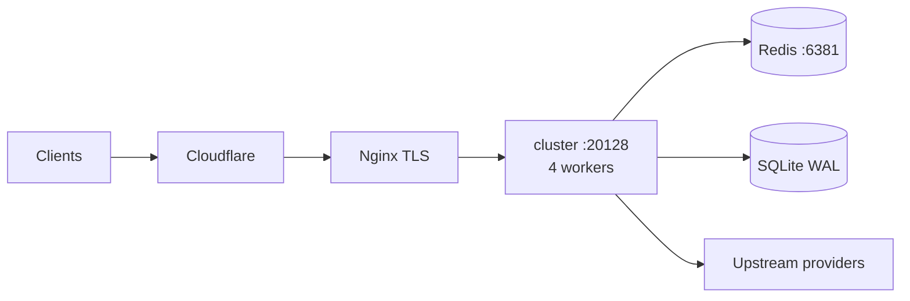

<div align="center">


# 9router-MW

**Production multi-worker AI routing gateway** — OpenAI-compatible `/v1/*`, high-concurrency cluster, Redis-shared resilience, undici keep-alive.

Fork of [decolua/9router](https://github.com/decolua/9router) optimized for **stable throughput at ~200 concurrent** on a bare-metal Linux VPS.

[](https://github.com/fazulfi/9router-mw/releases/latest)
[](https://github.com/decolua/9router)
[](./docs/RELEASE.md)
[](./LICENSE)

**Public production:** [https://example.com](https://example.com) · **Health:** [`/api/health`](https://example.com/api/health)

[Release status](./docs/RELEASE.md) · [Architecture](./docs/ARCHITECTURE-MW.md) · [Runbooks](./docs/runbooks/) · [**Benchmarks**](./docs/bench/) · [Synthetic load](./docs/bench/report-mw-20260719.md) · [Production soak](./docs/bench/report-production-soak-20260719.md) · [Upstream](https://github.com/decolua/9router)

</div>

---

## What this is

| | |
| --- | --- |
| **Product** | `9router-mw` — multi-worker production line of 9Router |
| **Repo** | https://github.com/fazulfi/9router-mw |
| **Repo version** | `0.5.40-mw.2` (`VERSION` / `package.json`) — ancestry-merge of upstream/master |
| **Live binary** | **`0.5.40-mw.1`** formal release (`/opt/9router-mw/releases/0.5.40-mw.1/.next/standalone`) — current production |
| **Upstream base** | [decolua/9router](https://github.com/decolua/9router) `0.5.40` (ancestry merged) |
| **Resilience patterns** | Account semaphore + circuit breaker + settings cache (inspired by [Vanszs/VansRouter](https://github.com/Vanszs/VansRouter)) |

**Not** the npm package `9router` and **not** Docker Hub `decolua/9router`. This fork is private-ops / source deploy. For the general consumer product, install upstream.

---

## Why MW exists

Stock 9router is excellent as a single-process local gateway. Under high concurrent load on a multi-core VPS, a single Node process becomes the bottleneck (event-loop contention, sync SQLite/sql.js paths, no shared account claim across processes).

**9router-MW** keeps full upstream product capability (OpenAI-compatible API, multi-provider routing, RTK, combos, dashboard) and adds a production control plane:

1. **Always 4 workers** via `cluster.fork` in `custom-server.js` (no `WORKERS=1` production default)
2. **Redis `127.0.0.1:6381` only** — shared semaphore, circuit breaker, usage buffer
3. **SQLite better-sqlite3 + WAL** — source of truth; **sql.js banned** in prod multi-worker
4. **undici keep-alive Agent** — connection reuse on the provider hot path
5. **No double-request** — one client HTTP request → exactly one worker → one upstream call (combo/account fallback is product behavior, not cluster fan-out)

### Topology (production actual)

> Full mermaid system-context + worker hot path: **[`docs/ARCHITECTURE-MW.md`](./docs/ARCHITECTURE-MW.md)**
> Upstream single-process product map (`db.json` / one “Local Process” box): [`docs/ARCHITECTURE.md`](./docs/ARCHITECTURE.md) — **not** this deploy.

```text
Clients (Claude Code, OpenCode, browser, OpenAI-compatible)
 → Cloudflare Proxied example.com
 → Nginx :443 Origin CA · Full (strict)
 → 127.0.0.1:20128 custom-server.js cluster
 primary (fork + respawn only)
 ├─ worker 1 ─┐
 ├─ worker 2 ─┤ each: Next standalone + open-sse
 ├─ worker 3 ─┤ undici keep-alive → upstream providers
 └─ worker 4 ─┘ (OAuth / API key / compatible nodes)
 │
 ├─ Redis 127.0.0.1:6381
 │ semaphore · circuit breaker · usage buffer
 │ mw:live:* (global dashboard pending/recent)
 └─ SQLite WAL /var/lib/9router-mw/db/data.sqlite
 better-sqlite3 · source of truth
MITM: OFF · foreign Redis :6379/:6380 untouched
```



### Double-request guarantee

Cluster is **capacity**, not **multiplication**. The kernel / Node cluster delivers each TCP/HTTP request to **exactly one** worker; that worker performs **one** upstream path (combo/account fallback is product routing, not fan-out). Proven under load: mock upstream request count == k6 client request count (`docs/bench/report-mw-20260719.md`).
---

## Production snapshot

| Check | Result |
| ----- | ------ |
| Public URL | https://example.com |
| `GET /api/health` | **200** — `ok`, `workers:4`, redis ready, undici, better-sqlite3/WAL |
| `GET /` | **307** → `/dashboard` |
| `GET /v1/models` (no key) | **401** API key required |
| App bind | `127.0.0.1:20128` only (not public) |
| Redis | **6381 only** — foreign `:6379` / `:6380` untouched |
| Edge | Cloudflare Proxied + Nginx TLS (Origin CA) + Full (strict) |

### Production invariants (never violate)

1. Workers always **4**
2. Redis only port **6381**
3. SQLite only **better-sqlite3 + WAL** (no sql.js)
4. MITM **OFF** in production
5. Bind **localhost**; public only via Nginx
6. **No secrets in git**
7. **No double-request** semantics
8. **Upstream ancestry** is real (no `--theirs` wholesale); merge resolves per-file with MW invariants taking precedence on production-affecting files

---

## Performance & benchmarks

Enterprise evidence pack: synthetic k6 gates **plus** production organic soak on the live public edge.
**Index:** [`docs/bench/`](./docs/bench/) · **SSOT release:** [`docs/RELEASE.md`](./docs/RELEASE.md)

### Scoreboard (headline)

| Suite | Mode | Result | Status |
| ----- | ---- | ------ | ------ |
| **§5 multi-worker load** | k6 health · 200 VU | **905.5 rps** = **2.53×** single baseline (~358 rps) | **GREEN** |
| p95 TTFB (health) | k6 | **241 ms** (target &lt; 2s) | **PASS** |
| Error rate | k6 | **0%** | **PASS** |
| No double upstream | mock counter 1:1 | client reqs = upstream reqs | **PASS** |
| Worker respawn | `kill -9` one worker | **~1 s** back to 4 workers | **PASS** |
| Full restart | systemd | **~2.8 s** ready | **PASS** |
| **Production organic** | real `/v1` traffic | **~166 RPM avg** · peak **~278 RPM** · **0× 5xx** | **GREEN** |
| Live dashboard aggregate | Redis `mw:live:*` | global recent/pending across 4 workers (no flicker) | **PASS** |
| **Ancestry-merge gate** | `git merge --no-ff upstream/master` | 13/13 commits folded, 0 behind upstream | **GREEN** |

> **Units:** synthetic tables use **RPS** (requests/second, health path). Organic tables use **RPM** (requests/minute from nginx `/v1` deltas). Do not mix when quoting.

### Synthetic load gate (§5) — GREEN

| Metric | Target | Measured |
| ------ | ------ | -------- |
| Concurrent | 200 VU | peak 200 · hold 2m |
| Throughput | ≥1.5× single (~358 rps) | **905.5 rps (2.53×)** |
| p95 TTFB (health) | &lt; 2s | **241 ms** |
| Error rate | &lt; 1% | **0%** |
| No double upstream | 1:1 mock | **PASS** |
| Worker kill respawn | &lt; 5s | **~1 s** |
| Full restart | &lt; 30s | **~2.8 s** |
| k6 soak | 30m (waiver 10m @ 100 VU) | ~946 rps · 0% fail |

Full methodology: [`docs/bench/report-mw-20260719.md`](./docs/bench/report-mw-20260719.md)

### Production organic soak — GREEN

Measured on **live** https://example.com after go-live (4 workers · Redis 6381 · undici · better-sqlite3+WAL).

| Run | Mode | Window | RPM avg | Peak RPM | 5xx | Workers |
| --- | ---- | ------ | ------- | -------- | --- | ------- |
| Pre-fix organic | real clients | ~10m | ~100 | ~234 | 0 | 4 |
| Post-fix soak | synth + organic | ~10m | ~192 | ~260 | 0 | 4 |
| **Monitor (showcase)** | **organic only** | **~7.5m** | **~166** | **~278** | **0** | **4** |

**Showcase window (2026-07-19 UTC):** cum `/v1` **1,243** · cum total **1,307** · redis ok · health always 200 · `workerId` rotates **1–4** (round-robin, not double-request).

```text
Organic RPM timeline (est. per 30s window ×2)
~64 → ~58 → ~104 → ~136 → ~186 → ~144 → ~174 → ~188
→ ~228 → ~204 → ~230 → ~210 → ~278 → ~278 → ~4 (quiet tail)
```

Full production report: [`docs/bench/report-production-soak-20260719.md`](./docs/bench/report-production-soak-20260719.md)

### What “no double-request” means

| Claim | Meaning | Proof |
| ----- | ------- | ----- |
| Cluster capacity | 1 client HTTP request → **exactly one** worker | health `workerId` rotation under load |
| Upstream isolation | 1 client request → **1** mock upstream call | k6 mock counter equality |
| Not fan-out | Workers do **not** each re-dispatch the same client request | mock 1:1 + organic path analysis |

Combo / account **fallback** (try next account on failure) is product routing behavior — not cluster multiplication.

### Multi-worker live UI integrity

| Before | After |
| ------ | ----- |
| Dashboard “RECENT REQUESTS” flickered (per-worker in-memory ring) | Redis-backed global ring `mw:live:recent` (cap 50) + pending counters |
| SSE on worker A missed traffic on B/C/D | stream route livePoll **1.5s** reads shared Redis snapshot |

Module: `open-sse/services/liveUsageState.js` · fail-open if Redis down.

### Reproduce

```bash
# Synthetic (from repo)
k6 run docs/bench/k6-load-health-200.js
k6 run docs/bench/k6-load-mock-upstream.js
k6 run docs/bench/k6-soak-health.js

# Live health
curl -sS https://example.com/api/health | jq .
```

---

## Quick start (local development)

Requires Node.js 22+, and for multi-worker parity: Redis on a dedicated port + native `better-sqlite3`.

```bash
git clone https://github.com/fazulfi/9router-mw.git
cd 9router-mw
npm install
# optional: build native SQLite (required for prod-like path)
npm rebuild better-sqlite3

# minimal env (do not commit real secrets)
export PORT=20128
export WORKERS=4
export REDIS_URL=redis://127.0.0.1:6381
export DATA_DIR=./data
export REQUIRE_API_KEY=true
export ENABLE_REQUEST_LOGS=false

npm run build
node custom-server.js
```

- Dashboard: `http://127.0.0.1:20128/dashboard`
- Health: `http://127.0.0.1:20128/api/health`
- OpenAI-compatible API: `http://127.0.0.1:20128/v1/*` (API key required when `REQUIRE_API_KEY=true`)

**Production deploy** is systemd + Nginx + dedicated Redis Docker on the VPS — not `npm start` on a public interface. See:

- [`docs/runbooks/deploy.md`](./docs/runbooks/deploy.md)
- [`docs/deploy/`](./docs/deploy/)
- [`docs/RELEASE.md`](./docs/RELEASE.md)

### Critical environment variables

| Variable | Production intent |
| -------- | ----------------- |
| `WORKERS` | Always `4` |
| `REDIS_URL` / Redis host | `127.0.0.1:6381` only |
| `DATA_DIR` | e.g. `/var/lib/9router-mw` |
| `REQUIRE_API_KEY` | `true` for remote `/v1/*` |
| `ENABLE_REQUEST_LOGS` | `false` under load |
| `PORT` | `20128` (bound localhost behind Nginx) |

Secrets (`JWT_SECRET`, `API_KEY_SECRET`, `INITIAL_PASSWORD`, provider tokens) live only in the host env file (e.g. `/etc/9router-mw/env`) — never in this repository.

---

## Documentation map

| Document | Role |
| -------- | ---- |
| [`docs/RELEASE.md`](./docs/RELEASE.md) | **SSOT** — production final status, version map, sign-off |
| [`docs/ARCHITECTURE-MW.md`](./docs/ARCHITECTURE-MW.md) | **Production system context** (mermaid) — multi-worker, Redis, SQLite, edge |
| [`docs/plans/9router-mw-production-plan.md`](./docs/plans/9router-mw-production-plan.md) | Locked architecture plan (executed) |
| [`docs/runbooks/`](./docs/runbooks/) | Deploy, rollback, backup, go-live, upstream-sync |
| [`docs/deploy/`](./docs/deploy/) | systemd, nginx, env examples, ops scripts |
| [`docs/bench/`](./docs/bench/) | Bench index — synthetic + production |
| [`docs/bench/report-mw-20260719.md`](./docs/bench/report-mw-20260719.md) | §5 synthetic load gate (2.53×) |
| [`docs/bench/report-production-soak-20260719.md`](./docs/bench/report-production-soak-20260719.md) | Production organic soak (~166 RPM) |
| [`docs/evidence/`](./docs/evidence/) | Phase 00–09 proofs |
| [`docs/ARCHITECTURE.md`](./docs/ARCHITECTURE.md) | Upstream 9router architecture (stock) |
| [`CHANGELOG.md`](./CHANGELOG.md) | Version history (mw section) |

---

## Product capabilities (upstream)

Everything you expect from 9Router remains available on this fork:

- OpenAI-compatible **`/v1/chat/completions`**, **`/v1/models`**, streaming SSE
- Multi-provider routing with format translation (OpenAI pivot)
- Account rotation, combos, quota-aware fallback
- **RTK** token saver and related pre-dispatch hooks
- Web dashboard for providers, proxies, combos, usage
- **Cursor HTTP/2 AgentService** (upstream 3.12.17) — live model catalog, `responseFormat: FORMATS.OPENAI` MW hotfix
- **i18n** Khmer (km) — folded from upstream 9ba8f374

Deep product guides, provider setup videos, and consumer install paths live upstream:

- Upstream repo: https://github.com/decolua/9router
- Upstream site: https://9router.com

This README intentionally does **not** duplicate the full marketing catalog or i18n grid — those belong to upstream.

---

## Versioning

| Artifact | Version |
| -------- | ------- |
| Upstream base | `decolua/9router` **0.5.40** (ancestry-merged) |
| Git tag (latest) | **`v0.5.40-mw.2`** (ancestry-merge of upstream/master; 0 behind) |
| Repo `VERSION` / `package.json` | **0.5.40-mw.2** |
| Live runtime release dir | **`0.5.40-mw.1`** (formal deploy; rollback: `0.5.35-mw.7`) |

Scheme: `0.5.X-mw.N` = upstream base + multi-worker production line.
**mw.1** was the Cursor `responseFormat: FORMATS.OPENAI` hotfix (live at d9702c68).
**mw.2** is the upstream ancestry-merge (real `git merge --no-ff upstream/master`, 13/13 commits folded, MW invariants preserved).

---

## Ops & data (production)

| Area | State |
| ---- | ----- |
| Engineering F0–F9 | **ACCEPTED** |
| Load §5 (synthetic) | **GREEN** — 2.53× · 905.5 rps · 0% err |
| Production organic soak | **GREEN** — ~166 RPM avg · peak ~278 · 0× 5xx |
| Live usage (dashboard) | **GLOBAL** Redis `mw:live:*` (no worker flicker) |
| Public HTTPS | **LIVE** |
| Upstream ancestry | **0 commits behind** (mw.2 merge folded all 13) |
| Provider data | Migrated non-mimo connections + custom nodes + proxy pools + combos + model kv |
| `apiKeys` | Not auto-migrated — create on dashboard if needed |
| MITM | **OFF** |

Operational residual checklist (optional): real provider smoke at low QPS, 24–48h watch, monthly upstream sync via [`docs/runbooks/upstream-sync.md`](./docs/runbooks/upstream-sync.md).

Set `X-9Router-Token-Saver: off` to bypass all token savers for one chat request.

---

## Attribution & license

- **Base product:** [decolua/9router](https://github.com/decolua/9router) — original authors and community
- **Resilience ideas:** patterns adapted from [Vanszs/VansRouter](https://github.com/Vanszs/VansRouter) (semaphore / breaker / settings cache)
- **MW control plane:** multi-worker cluster, Redis shared state, undici pool, production ops — this repository
- **License:** MIT — see [`LICENSE`](./LICENSE)

Keep an `upstream` remote and follow [`docs/runbooks/upstream-sync.md`](./docs/runbooks/upstream-sync.md) for monthly rebases.

---

## Contributing

| Kind of change | Where |
| -------------- | ----- |
| Multi-worker, Redis, undici, deploy, MW docs | Issues / PRs on **this** repo |
| New providers, translators, dashboard features for everyone | Prefer **upstream** [decolua/9router](https://github.com/decolua/9router) then sync |

Please do not open PRs that reintroduce:

- sql.js as the production SQLite path under multi-worker
- Redis on 6379/6380 for this product
- Secrets, production env files, or private keys in git
- `WORKERS=1` as a production default
- Wholesale acceptance of upstream marketing/README into the MW surface
- Resurrection of the canceled `/mw` independent dashboard

---

## Support pointers

| Need | Link |
| ---- | ---- |
| Is production healthy? | https://example.com/api/health |
| Final release status | [`docs/RELEASE.md`](./docs/RELEASE.md) |
| Deploy / rollback | [`docs/runbooks/`](./docs/runbooks/) |
| Benchmarks (all) | [`docs/bench/`](./docs/bench/) |
| Synthetic load (2.53×) | [`docs/bench/report-mw-20260719.md`](./docs/bench/report-mw-20260719.md) |
| Production soak (~166 RPM) | [`docs/bench/report-production-soak-20260719.md`](./docs/bench/report-production-soak-20260719.md) |
| Upstream product help | https://github.com/decolua/9router |

---

<div align="center">

**9router-MW** · PRODUCTION FINAL · `v0.5.40-mw.2`
**2.53×** synthetic · **~166 RPM** organic · **0%** 5xx under peak · **0 commits behind** upstream
Built on [decolua/9router](https://github.com/decolua/9router) · High-concurrency production routing

</div>
