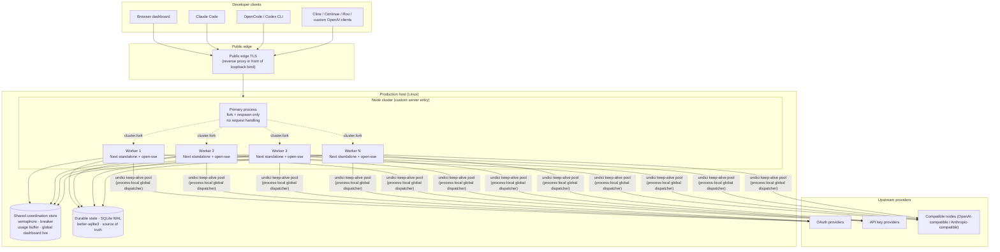
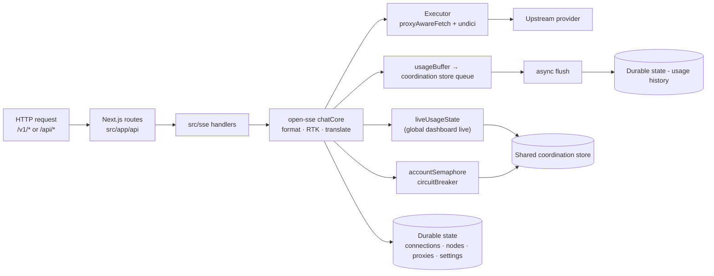
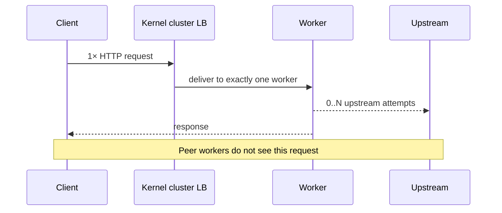
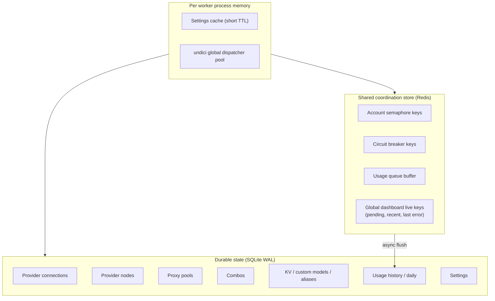

# 9router-MW Architecture (Production Topology)

> **Scope:** conceptual production topology of the 9router-MW line.
> **Upstream (stock single-process):** [`docs/ARCHITECTURE.md`](./ARCHITECTURE.md) — describes the stock product, **not** this production runtime.

This file describes the **public-safe, conceptual** topology of the multi-worker production line. It does not name concrete hostnames, ports, file paths, container names, or service identifiers; those are deployment-specific and intentionally maintained outside public documentation.

---

## 1. What this diagram is (and is not)

| Document | Describes |
| -------- | --------- |
| **This file** | **Production 9router-MW** — public edge → reverse proxy → multi-worker cluster → shared coordination store + durable state + undici pool |
| [`docs/ARCHITECTURE.md`](./ARCHITECTURE.md) | **Upstream decolua/9router** high-level product map (single process + legacy local storage names) |

If a diagram shows a single process box, `db.json`, or `usage.json + log.txt` as primary storage, it is **upstream product context**, not the MW production runtime.

---

## 2. High-level system context (production)



### Topology facts (production)

| Layer | Property |
| ----- | -------- |
| Public edge | Public edge TLS (proxy) terminates external traffic and forwards to a loopback application bind |
| Application bind | Loopback only (not public) |
| Coordination store | Dedicated, deployed on a port reserved for this product (unrelated legacy ports on the same host are not used) |
| Durable state | Better-sqlite3 driver with WAL journaling |
| MITM | **OFF** in production |
| Workload split | One primary process forks N workers; the primary does not handle requests and only respawns workers on exit |

---

## 3. Inside one worker (request path)

Each worker is a full **Next.js standalone** process (dashboard + `/api/*` + `/v1/*`). Cluster sharing means **one accepted connection → one worker** (no fan-out across workers).



### Hot path (chat) — abstract

```text
Client → public edge TLS → reverse proxy → worker N (loopback bind)
 → /v1/* rewrite → /api/v1/*
 → src/sse/handlers/chat.js
 → open-sse/handlers/chatCore.js
 detect format → translate (or passthrough)
 RTK / hooks (fail-open)
 account claim (shared coordination-store semaphore) + circuit breaker
 → open-sse/executors/* (undici keep-alive pool)
 → stream/non-stream response → client
 → trackPending / pushRecent (global dashboard live, coordination store)
 → usage buffer → durable state history
```

---

## 4. Cluster & ownership model



| Claim | Meaning |
| ----- | ------- |
| **No cluster fan-out** | 1 client HTTP request → **exactly one** worker |
| **No broadcast** | The primary does **not** rebroadcast the same request to all workers |
| **Worker = unit of ownership** | All upstream attempts, retries, fallbacks, and fusion calls for a client request happen inside the worker that owns it |
| **Upstream attempts are 0..N** | Within the assigned worker, product behavior may produce any number of upstream calls (see §5) |

### Worker count

| Item | Property |
| ---- | -------- |
| Entry | Cluster primary in `custom-server.js` uses `cluster.fork` |
| Env | `WORKERS` (production default: 4) |
| Production lock | Production runtime forces the multi-worker count; a single-worker default is not used in production |
| Code ceiling | Hard ceiling in code (see `resolveWorkerCount`) |
| Respawn | Primary listens to `cluster.on("exit")` and forks a replacement |

---

## 5. Per-request upstream attempts (inside the owning worker)

The cluster guarantees **no fan-out**, but inside the owning worker the upstream call count for one client request is **0..N**. The product behaviors that produce these calls are:

| Behavior | When it triggers | Effect on upstream call count |
| -------- | ---------------- | ----------------------------- |
| Local synthetic/bypass handling | Eligible request is answered locally | Zero upstream calls |
| Token-refresh retry | Refreshable auth failure (401/403 on OAuth) | One authentication refresh plus another model attempt |
| Status / URL retry | Transient network or redirect conditions | +1 per eligible retry |
| Account fallback | Current account is on cooldown or returns an auth error | +1 per next attempted account |
| Provider fallback | Whole provider is unavailable | +1 per next attempted provider |
| Combo fallback | Combo sequence — current model is exhausted, move to next model in the combo | +N as the combo steps forward |
| State-fusion fan-out | Fusion orchestration: N panel calls plus a judge call | +N panel calls + 1 judge call |

Each of these is **product routing or orchestration** that happens inside the worker that owns the request. None of them are cluster fan-out.

---

## 6. Shared state map (abstract)



| Store | Role | Not used in production |
| ----- | ---- | --------------------- |
| **Shared coordination store** | Cross-worker claim, breaker, usage buffer, global dashboard live | — |
| **Durable state (SQLite WAL)** | Credentials, nodes, proxies, combos, settings, durable usage | — |
| `db.json` | — | Upstream legacy diagram only |
| `usage.json` + `log.txt` | — | Not the primary MW path |
| **`sql.js` legacy path** | — | Not used in multi-worker production |

### Live dashboard integrity

| Before | After |
| ------ | ----- |
| Per-process in-memory pending/recent ring flickered across workers | Shared coordination-store global ring + pending counters |
| SSE on one worker missed traffic on the others | Stream route polls the shared snapshot at a short interval |

The live-usage module is `open-sse/services/liveUsageState.js`. The dashboard stays usable (fail-open) when the coordination store is unavailable.

---

## 7. API surface (same product, multi-worker runtime)

| Surface | Path | Auth |
| ------- | ---- | ---- |
| Health | `GET /api/health` | public |
| Dashboard | `/dashboard`, `/api/*` | session / password |
| OpenAI-compatible | `/v1/*` | API key when `REQUIRE_API_KEY=true` |
| Anthropic-style clients | often `/v1/v1/messages` (client double-prefix quirk) | API key |

The health response shape (conceptual) is:

```json
{
 "ok": true,
 "workerId": "<one of the workers>",
 "pid": 123456,
 "workers": 4,
 "redis": { "ok": true, "mode": "redis", "status": "ready" },
 "hotpath": {
  "undici": { "enabled": true, "connections": 32, "keepAliveTimeout": 30000 },
  "sqlite": { "driver": "better-sqlite3", "journalMode": "wal" }
 }
}
```

---

## 8. Production invariants

1. **Multi-worker default** in production (no single-worker default)
2. **Shared coordination store on a dedicated port** (unrelated legacy ports are not used)
3. **Better-sqlite3 + WAL only** (no `sql.js` legacy path in multi-worker production)
4. **Loopback application bind**; public traffic only via the public edge TLS layer
5. **No secrets in git**
6. **No cluster fan-out** — cluster is capacity, not multiplication
7. **MITM OFF** in production
8. **Foreign stacks untouched** — other applications on the same host are not affected

---

## 9. Upstream diagram vs MW (delta)

| Upstream system-context box | MW production |
| --------------------------- | ------------- |
| One local process box | **Primary + N workers** via `cluster.fork` |
| `db.json` | **SQLite WAL** durable state |
| `usage.json + log.txt` | **Coordination-store buffer + SQLite** usage tables + global dashboard live keys |
| No edge | **Public edge TLS → reverse proxy → loopback bind** |
| No shared coordination store | **Shared coordination store** as a cross-worker control plane |
| Optional cloud sync | Not part of the MW production control plane |

Product capabilities (providers, combos, RTK, OpenAI `/v1`) remain; **runtime topology changed**.

---

## 10. Production vs stock local setup (Docker Compose / single-process)

| Aspect | Stock `docker-compose` / local | MW production |
| ------ | ----------------------------- | ------------- |
| Process model | Single Next.js process | Multi-worker cluster with primary + N workers |
| Coordination store | Not used | Shared coordination store (Redis) on a dedicated port |
| Durable state | `db.json` / `usage.json` (local files) | SQLite WAL via better-sqlite3 |
| Upstream pool | Default per-process HTTP agent | undici keep-alive pool (process-local global dispatcher) |
| Public exposure | Direct host port or local proxy | Public edge TLS → reverse proxy → loopback bind |
| Fan-out guarantee | N/A (single process) | **No cluster fan-out**; per-worker upstream attempts are 0..N |
| MITM | Optional | OFF |

The stock `docker-compose` / single-process layout remains the local development path. Production is a separate runtime described above.

---

## 11. Related paths in repo (public-safe)

| Path | Role |
| ---- | ---- |
| `custom-server.js` | Cluster primary + workers; derives real client IP from the TCP socket |
| `open-sse/` | Chat core, executors, translator, coordination-store services |
| `open-sse/services/liveUsageState.js` | Global pending/recent for the dashboard |
| `open-sse/services/redisClient.js` | Coordination-store client and fail-open helpers |
| `src/lib/db/` | SQLite adapters (prod: better-sqlite3) |
| `docs/ARCHITECTURE.md` | Upstream product architecture (stock) |
