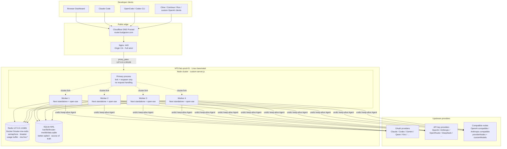
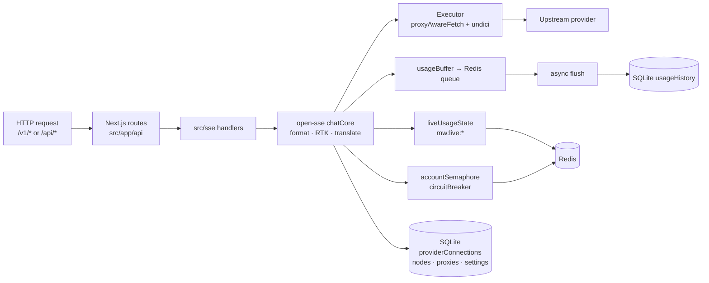
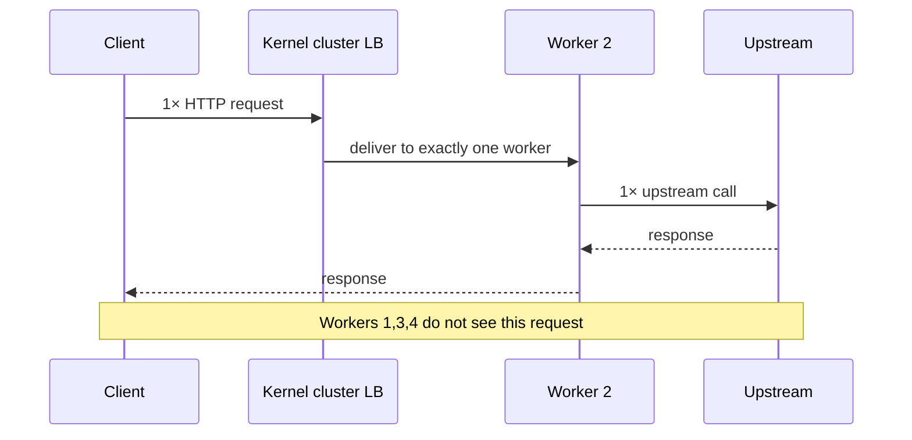
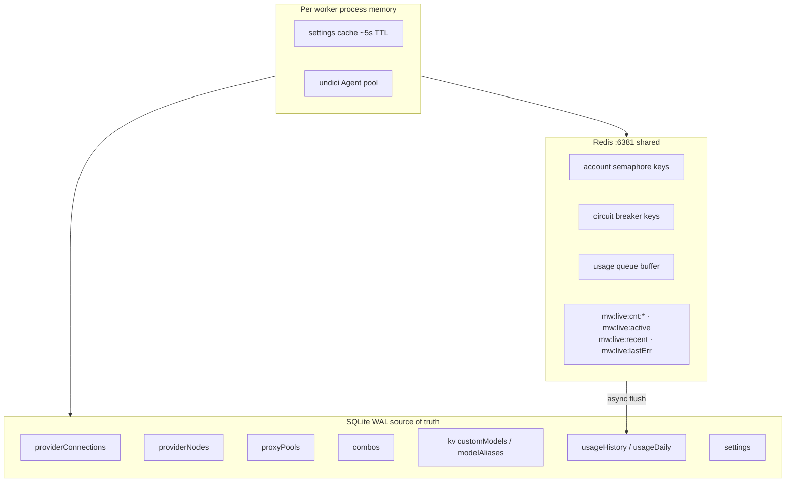

# 9router-MW Architecture (Production)

> **Status:** PRODUCTION FINAL · live **`0.5.35-mw.7`** (2026-07-19)  
> **Verified against:** `https://router.budgezen.com/api/health` · host `faiz-prod-01` · bind `127.0.0.1:20128` · Redis `127.0.0.1:6381`  
> **SSOT release:** [`docs/RELEASE.md`](./RELEASE.md)  
> **Upstream (stock single-process):** [`docs/ARCHITECTURE.md`](./ARCHITECTURE.md) — **not** this topology  
> **Plan:** [`docs/plans/9router-mw-production-plan.md`](./plans/9router-mw-production-plan.md)

---

## 1. What this diagram is (and is not)

| Document | Describes |
| -------- | --------- |
| **This file** | **Actual production 9router-MW** — Cloudflare → Nginx → multi-worker cluster → Redis + SQLite + undici |
| [`docs/ARCHITECTURE.md`](./ARCHITECTURE.md) | **Upstream decolua/9router** high-level product map (often shown as one “Local Process” + `db.json` / `usage.json`) |

If a diagram shows a single process box, `db.json`, or `usage.json + log.txt` as primary storage, it is **upstream product context**, not MW production.

---

## 2. High-level system context (production actual)



### Edge facts (live)

| Layer | Actual |
| ----- | ------ |
| Public hostname | `https://router.budgezen.com` |
| Edge TLS | Cloudflare Proxied + Nginx Origin CA, SSL mode **Full (strict)** |
| App bind | **`127.0.0.1:20128` only** (not public) |
| Redis bind | **`127.0.0.1:6381` only** (foreign `:6379` / `:6380` untouched) |
| Data dir | `/var/lib/9router-mw` |
| Release dir | `/opt/9router-mw/releases/0.5.35-mw.7/.next/standalone` |
| MITM | **OFF** |

---

## 3. Inside one worker (request path)

Each worker is a full **Next.js standalone** process (dashboard + `/api/*` + `/v1/*`).  
Cluster sharing means **one accepted connection → one worker** (no fan-out).



### Hot path (chat)

```text
Client → CF → Nginx → worker N :20128
  → /v1/* rewrite → /api/v1/*
  → src/sse/handlers/chat.js
  → open-sse/handlers/chatCore.js
       detect format → translate (or passthrough)
       RTK / hooks (fail-open)
       account claim (Redis semaphore) + circuit breaker
  → open-sse/executors/*  (undici keep-alive)
  → stream/non-stream response → client
  → trackPending / pushRecent (Redis mw:live:*)
  → usage buffer → SQLite history
```

---

## 4. Cluster & double-request model



| Claim | Meaning |
| ----- | ------- |
| **No double-request** | 1 client HTTP request → **exactly one** worker → **one** upstream attempt path |
| **Not fan-out** | Primary does **not** rebroadcast the same request to all workers |
| **Combo / account fallback** | Product routing (try next account/model on failure) — **not** cluster multiplication |
| **Proof** | k6 mock counter 1:1 · health `workerId` rotates 1–4 under load |

### Worker count (code vs production lock)

| Item | Actual |
| ---- | ------ |
| Entry | `custom-server.js` — `cluster.fork` |
| Env | `WORKERS` (default **4**) |
| Production floor | `NODE_ENV=production` forces **≥ 4** unless `MW_ALLOW_SINGLE=1` |
| Hard ceiling in code | **16** (`resolveWorkerCount`) |
| **This VPS lock** | Always **4** (match 4 vCPU; proven bench) |
| Respawn | primary listens `cluster.on("exit")` → fork replacement |

---

## 5. Shared state map



| Store | Role | Not used in prod |
| ----- | ---- | ---------------- |
| **Redis 6381** | Cross-worker claim, breaker, usage buffer, **global dashboard live** (`mw:live:*`) | — |
| **SQLite WAL** | Credentials, nodes, proxies, combos, settings, durable usage | — |
| `db.json` | — | Upstream legacy diagram only |
| `usage.json` + `log.txt` | — | Not primary MW path |
| **sql.js** | — | **Banned** in prod multi-worker |

### Live dashboard integrity (mw.7)

| Before | After |
| ------ | ----- |
| `global._pendingRequests` / `_recentRing` per process | Redis `mw:live:*` shared |
| SSE on worker A missed B/C/D traffic → flicker | `liveUsageState` + stream `livePoll` 1.5s |

Module: `open-sse/services/liveUsageState.js` · fail-open if Redis down.

---

## 6. API surface (same product, multi-worker runtime)

| Surface | Path | Auth |
| ------- | ---- | ---- |
| Health | `GET /api/health` | public |
| Dashboard | `/dashboard`, `/api/*` | session / password |
| OpenAI-compatible | `/v1/*` | API key when `REQUIRE_API_KEY=true` |
| Anthropic-style clients | often `/v1/v1/messages` (client double-prefix quirk) | API key |

Health contract (live shape):

```json
{
  "ok": true,
  "workerId": "1|2|3|4",
  "pid": 123456,
  "workers": 4,
  "redis": { "ok": true, "mode": "redis", "status": "ready" },
  "hotpath": {
    "undici": { "enabled": true, "connections": 32, "keepAliveTimeout": 30000 },
    "sqlite": { "driver": "better-sqlite3", "journalMode": "wal" }
  }
}
```

---

## 7. Production invariants (never violate)

1. **Workers = 4** on this production host (ops lock; code allows 4–16)  
2. **Redis only port 6381** — never reuse foreign 6379/6380  
3. **better-sqlite3 + WAL only** — no sql.js in prod multi-worker  
4. **Bind localhost** — public only via Cloudflare + Nginx  
5. **No secrets in git**  
6. **No double-request** semantics (cluster = capacity)  
7. **MITM OFF** in production  
8. **Foreign stacks untouched** (other redis/app units on host)

---

## 8. Upstream diagram vs MW (delta)

| Upstream system-context box | MW production actual |
| --------------------------- | -------------------- |
| “9Router Local Process” (one box) | **Primary + 4 workers** via `cluster.fork` |
| `db.json` | **SQLite WAL** `data.sqlite` |
| `usage.json + log.txt` | **Redis buffer + SQLite** usage tables + `mw:live:*` |
| No edge | **Cloudflare → Nginx → 127.0.0.1:20128** |
| No Redis | **Redis 6381** shared control plane |
| Optional cloud sync | Not part of MW production control plane |

Product capabilities (providers, combos, RTK, OpenAI `/v1`) remain; **runtime topology changed**.

---

## 9. Related paths in repo

| Path | Role |
| ---- | ---- |
| `custom-server.js` | cluster primary + workers, real client IP wrapper |
| `open-sse/` | chat core, executors, translator, Redis services |
| `open-sse/services/liveUsageState.js` | global pending/recent for dashboard |
| `open-sse/services/redisClient.js` | ioredis client, fail-open helpers |
| `src/lib/db/` | SQLite adapters (prod: better-sqlite3) |
| `docs/deploy/` | systemd, nginx, env examples |
| `docs/bench/` | synthetic + organic proof |

---

## 10. Verify live topology

```bash
curl -sS https://router.budgezen.com/api/health | jq .
# expect: ok=true, workers=4, redis.ok=true, undici.enabled, better-sqlite3, wal

# on VPS
ss -lntp | grep -E '20128|6381'
# 127.0.0.1:20128  node
# 127.0.0.1:6381   docker-proxy (9router-mw-redis)

readlink -f /opt/9router-mw/current
cat /opt/9router-mw/current/VERSION
# → .../0.5.35-mw.7/.next/standalone · 0.5.35-mw.7
```
